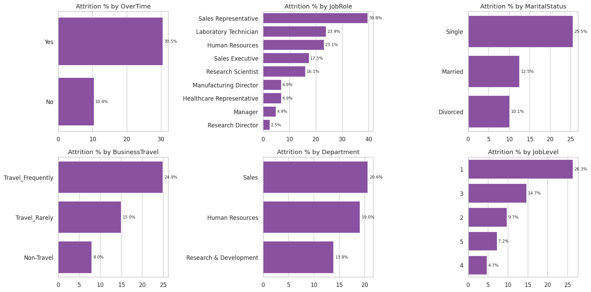
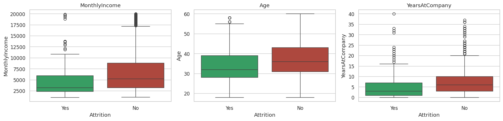
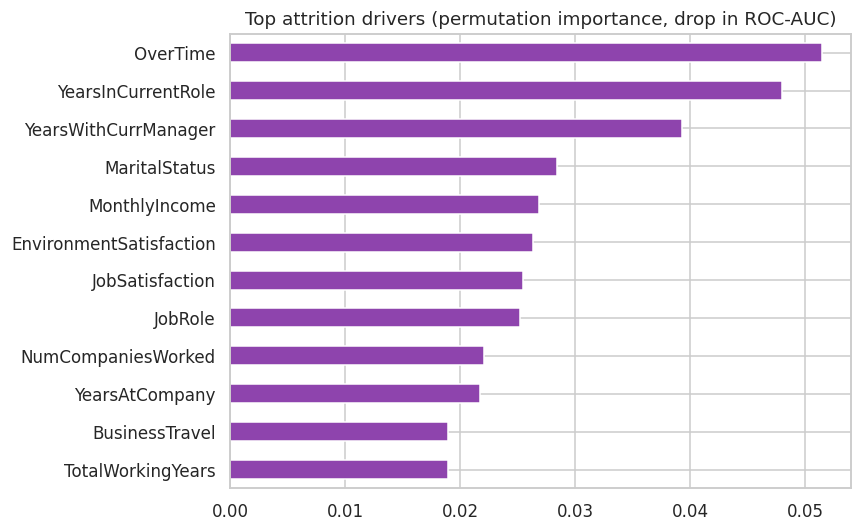

# 👥 HR Employee Attrition Analytics

  

**Business problem:** HR wants to know **why employees leave**, **who is at risk**, and **what attrition costs**. I combined EDA, **statistical hypothesis testing**, a **predictive model** and a **cost analysis**, and produced a **Tableau-ready data model** for an interactive HR dashboard.

## 📊 Dataset
[IBM HR Analytics Employee Attrition](https://github.com/IBM/employee-attrition-aif360): **1,470 employees × 35 attributes**. Overall attrition rate: **16.1%** (237 leavers).

## 🛠️ Approach
1. **Cleaning:** removed 3 constant columns; no missing values
2. **EDA:** attrition by overtime, role, marital status, travel, department, job level, pay, age and tenure
3. **Statistical testing:** chi-square tests (categorical) and Mann-Whitney U tests (numeric), α = 0.05
4. **Predictive model:** Logistic Regression and Random Forest (class-balanced), with **permutation importance** for explainability
5. **Business cost:** replacement cost estimated at 50% of annual salary
6. **Tableau extract:** employee-level table with risk score, risk tier and banded fields → [`tableau/`](tableau/)

## 🏆 Results
- **Logistic Regression ROC-AUC: 0.857** (Random Forest 0.837). It catches **78% of leavers** in the test set.
- **Estimated attrition cost: ≈ $6.8M** (≈ $28.7K per leaver)
- 17 of 19 tested factors differ significantly between leavers and stayers. **Gender and salary-hike % do not.**

| Driver | Attrition rate |
|---|---|
| Overtime **Yes** vs No | **30.5%** vs 10.4% |
| Sales Representatives (highest role) | **39.8%** (Research Directors: 2.5%) |
| Single vs Married | **25.5%** vs 12.5% |
| Travel frequently vs Non-travel | **24.9%** vs 8.0% |
| Job Level 1 vs Level 4 | **26.3%** vs 4.7% |
| No stock options vs Level 1 | **24.4%** vs 9.4% |
| **Overtime + bottom-quartile pay** | 🚨 **58.5%** (vs 8.1% for no overtime and higher pay) |

Median leaver: **$3,202/month**, 32 years old, 3 years at the company. Median stayer: $5,204, 36 years old, 6 years.

## 📈 Visuals


| Pay, age & tenure | Top drivers (model) |
|---|---|
|  |  |

## 💡 Recommendations
1. **Tackle overtime first.** It is the strongest driver. Cap sustained overtime and hire into overloaded teams.
2. **Review pay for junior roles** (Sales Reps, Lab Technicians, Level 1). Overtime combined with low pay is where people leave.
3. **Extend stock options or retention bonuses** to high-risk staff.
4. **Offer travel flexibility** to frequent travellers.
5. **Run monthly stay-interviews** with the model's **High-risk tier** (349 employees), tracked in the Tableau dashboard.

## 📊 Tableau dashboard
`tableau/hr_attrition_tableau.csv` plus [`tableau/DASHBOARD_GUIDE.md`](tableau/DASHBOARD_GUIDE.md): calculated fields and the layout for an "HR Attrition Command Center" dashboard (KPIs, attrition by role, overtime × pay heatmap, risk tiers).

## ▶️ How to run
```bash
pip install -r requirements.txt
jupyter notebook hr_attrition_analysis.ipynb
```

---
👤 **Ansh Rai**, Data Analyst · [LinkedIn](https://www.linkedin.com/in/anshrai-adr) · [GitHub](https://github.com/ANSHRAI21) · [Portfolio](https://a-s-pyratech-solutions.space)
